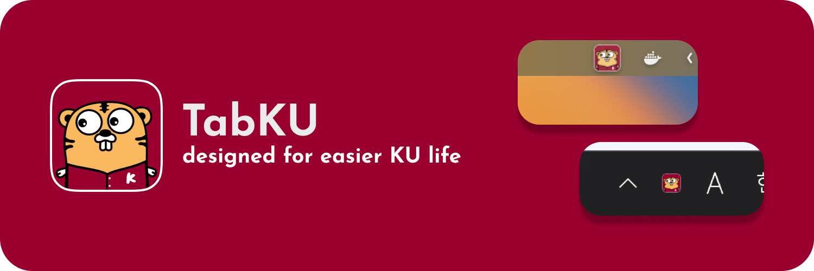

# TabKU

  

  

This is a simple service that collects and displays all the URLs related to Korea University. It can be useful for anyone who wants to easily access multiple Korea University websites at once.

# Features
* All URLs of Korea University are gathered and listed in one place.
* URLs are categorized into different sections for easy navigation.

# Installation

  
  
  

To install TabKU, the Korea University URL Aggregator, There are three options. Once you arrive at the [release link](https://github.com/ziweek/TabKU/releases), you can browse through the different sections to find the version you need. You can also use the search bar to quickly find specific version.

### PWA

Installing on iOS:

1. Open Safari on your iOS device and navigate to the URL where your PWA is hosted.
2. Tap the Share icon at the bottom of the screen.
3. Scroll down and tap on "Add to Home Screen".
4. On the next screen, you can rename the app if desired. Tap "Add" in the upper right corner.
5. The PWA icon will appear on your home screen. Tap it to launch the app.

Installing on Android:

1. Open the Chrome browser on your Android device and navigate to the URL where your PWA is hosted.
2. Tap the three-dot menu in the upper right corner of the screen.
3. Tap "Add to Home Screen".
4. On the next screen, you can rename the app if desired. Tap "Add" in the upper right corner.
5. The PWA icon will appear on your home screen. Tap it to launch the app.

### macOS

1. To install this app, download the app file from the release.
2. Once the file is downloaded, drag the app icon to the Applications folder.
3. You can then launch the app in the Applications folder or from the Launchpad.

### Windows

If you would like to suggest a new URL to be added to the list, simply click on the "Suggest a URL" button and fill out the form. Our team will review your suggestion and add it to the list if it meets our criteria.

# Getting Started

To get started with TabKU, the Korea University URL Aggregator, simply visit the website at [release](https://github.com/ziweek/TabKU/releases). Once you arrive at the website, you can browse through the different sections to find the version you need. You can also use the search bar to quickly find specific version.

### PWA

If you would like to suggest a new URL to be added to the list, simply click on the "Suggest a URL" button and fill out the form. Our team will review your suggestion and add it to the list if it meets our criteria.

### macOS

If you would like to suggest a new URL to be added to the list, simply click on the "Suggest a URL" button and fill out the form. Our team will review your suggestion and add it to the list if it meets our criteria.

### Windows

If you would like to suggest a new URL to be added to the list, simply click on the "Suggest a URL" button and fill out the form. Our team will review your suggestion and add it to the list if it meets our criteria.

# Architecture

  
  
  

The architecture of this project provides a solid foundation for building modern, high-performance web applications that can be easily deployed and accessed across a variety of platforms. This architecture involves several key technologies. 

### Next.js

The frontend was developed using Next.js, a popular React framework that enables server-side rendering and automatic code splitting. This helps to optimize the performance of the application by reducing the load time and improving the user experience.

### Vercel

The project was deployed using Vercel, a cloud platform for static and serverless websites. This platform provides a fast and scalable infrastructure for hosting the application, as well as continuous integration and deployment capabilities.

### Electron

Finally, the project utilizes Electron as a webview to create a desktop application with web technologies. Electron allows developers to build cross-platform desktop applications using web technologies like HTML, CSS, and JavaScript.

# Changelog
* 20230426 - first release for macOS

# Contributions

  
  

If you would like to contribute to the Korea University URL Aggregator, please submit a pull request with your changes. I welcome contributions that improve the usability or functionality of the service. If you find any issues or have any suggestions for improvement, please contact me or open an issue. :)

<table>
  <tbody>
    <tr>
      <td align="center" valign="top" width="14.28%">
        <a href="https://github.com/cstria0106">
          
           
          
            <b>ziweek</b>
          
        </a>
      </td>
    </tr>
  </tbody>
</table>

# License
This project is licensed under the MIT License. See the [LICENSE file](https://github.com/ziweek/TabKU/blob/main/LICENSE) for details.
